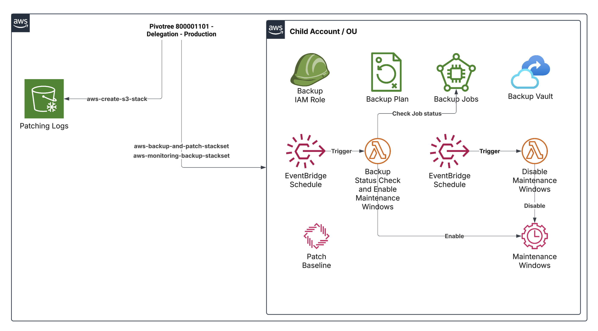
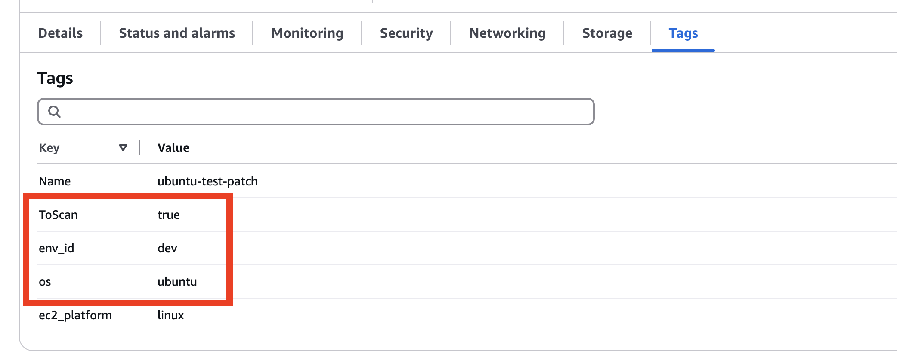

## About 

This AWS CloudFormation StackSet template provides a fully automated and region-aware solution to manage operating system patching and EC2 instance backups across multiple AWS accounts and environments. It is designed to support Site Reliability Engineering (SRE), DevOps, and Infrastructure teams in enforcing a consistent, compliant, and hands-off patching strategy throughout the organization.

**Patch Manager Automation with Pre-Patching Backup Workflow:**

The solution enables scheduled, automated patching of EC2 instances across the fleet, categorized by operating system (Amazon Linux, Ubuntu, Windows) and environment (lab, dev, qa, stg, uat, prd, sit). It uses AWS Systems Manager Patch Manager and Maintenance Windows to coordinate patching workflows, while AWS Backup ensures that a recovery point is created prior to any patch being applied. The solution can be extended further to support other operating systems as needed. 

## Architecture



## Prerequisites

1. **EC2 Instance Profile Configuration:**

   - The EC2 instance profile **must** have the following policies attached:
     - **S3 Write Access** – Required for writing patching logs to S3. Policy snippet below.
     - **AmazonSSMManagedInstanceCore** – Required for communication with AWS Systems Manager (SSM) for patching tasks. This is AWS Managed Policy.

```
{
    "Version": "2012-10-17",
    "Statement": [
        {
            "Effect": "Allow",
            "Action": [
                "s3:PutObject",
                "s3:PutObjectAcl",
                "s3:ListBucket",
                "s3:GetBucketLocation"
            ],
            "Resource": [
                "arn:aws:s3:::*",
                "arn:aws:s3:::*/*"
            ]
        }
    ]
}
```

2. Make sure `Ec2` and `EBS` volumes are tagged as needed. The cloudformation template backsup `EBS` volumes and `Ec2` Instances which are tagged by `PatchGroup:<os>-patch-group-<env_id>` and `ToBackupAndPatch:true`. Here value for tag key `PatchGroup` can be viewed in the outputs generated after deploying `aws-backup-and-patch-stackset`.

**Valid `PatchGroup` Tag Value**

| Key              | Value                      |
|------------------|----------------------------|
| PatchGroup       | `os`-patch-group-`env_id`  |

**Valid `ToBackupAndPatch` Tag Value**

| Key              | Value |
|------------------|-------|
| ToBackupAndPatch | true  |
  
**Valid `os` Values**

| Key | Value       |
|-----|-------------|
| os  | amazonlinux |
| os  | ubuntu      |
| os  | windows     |

**Valid `env_id` Values**

| Key     | Value |
|---------|-------|
| env_id  | lab   |
| env_id  | dev   |
| env_id  | qa    |
| env_id  | stg   |
| env_id  | uat   |
| env_id  | prd   |
| env_id  | sit   |

**AWS Console**



---

## Execution Steps

1. Execute `aws-create-s3-stack` and copy the `BucketName` from outputs. 

2. Run `aws-backup-and-patch-stackset` in the Child Account:

   - Coordinate the cron schedules for backup and patching tasks.
   - Ensure that the schedules are at least **2 hours apart** to allow for appropriate time management between backup and patching processes. The backup window is `2 hours` and maintainence window is `3 hours` 
   - The cron expression works specific to the region. For example if you schedule a cron for `8 PM` everyday for `us-east-1`, it will run `8 PM` specific to that region which is `8 PM EST`.
   - After obtaining the bucket name from the previous step-1 `aws-create-s3-stack`, run the `aws-backup-and-patch-stackset` as a stackset in the **child account** that has the EC2 instances to be patched.
   - Copy the `BackupVaultName`, `MaintenanceWindowName` and `PatchGroup` from the stackset output. `BackupVaultName` and `MaintenanceWindowName` will be needed as inputs in `aws-monitoring-backup-stackset` stackset where as `PatchGroup` is needed to tag the resources Ec2 and EBS volumes specific to that OS and Environment

3. Run `aws-monitoring-backup-stackset` with inputs recorded in the step-2. Make sure to coordinate the cron schedules for lambda functions based on backup and patching tasks schedule. This ensures Maintenance Window is enabled after the back-up window completes with all anticipated back-up jobs in completed status. The Maintenance Window is disabled after the Maintenance Window is completed as per the cron schedule.

## aws-create-s3-stack

This AWS CloudFormation template provisions an S3 bucket designed to store patching logs generated during Systems Manager (SSM) patching operations. The bucket name is dynamically constructed using the target operating system, environment, and a unique stack identifier. It includes security configurations to block public access and attaches a bucket policy that allows:

- The AWS Systems Manager service (ssm.amazonaws.com) to write logs to the bucket using PutObject, provided the object ACL is bucket-owner-full-control.

- IAM principals from a specified AWS Organization (PrincipalOrgID) to write to the bucket.

- The template supports dynamic deployment across various environments (lab, dev, qa, stg, uat, prd, sit) and operating systems (amazonlinux, ubuntu, windows).

### Parameters

| Name                   | Type     | Description                                                              | Default / Allowed Values                          |
|------------------------|----------|--------------------------------------------------------------------------|---------------------------------------------------|
| `PrincipalOrgID`       | String   | The AWS Organization ID allowed to put objects in the bucket             | `o-vea8mawl7w`                                     |
| `PatchingLogsBucketName`| String  | Name prefix of the S3 bucket used for storing patch logs                 | `aws-mgt-patching-logs`                           |
| `TargetOperatingSystem`| String   | The operating system for the patch baseline                              | `amazonlinux`, `ubuntu`, `windows`               |
| `Environment`          | String   | Deployment environment                                                    | `lab`, `dev`, `qa`, `stg`, `uat`, `prd`, `sit`    |

### Resources

**PatchingLogsBucket (AWS::S3::Bucket)**

| Property                          | Value/Description                                                                                 |
|----------------------------------|---------------------------------------------------------------------------------------------------|
| `BucketName`                     | `${PatchingLogsBucketName}-${TargetOperatingSystem}-${Environment}-${RandomGUID}`               |
| `PublicAccessBlockConfiguration` | Blocks all public access (`BlockPublicAcls`, `BlockPublicPolicy`, etc.)                          |

**PatchingLogsBucketPolicy (AWS::S3::BucketPolicy)**

| Statement ID     | Effect | Principal              | Action          | Resource                          | Condition                                                                 |
|------------------|--------|------------------------|-----------------|-----------------------------------|---------------------------------------------------------------------------|
| *(None)*         | Allow  | `ssm.amazonaws.com`    | `s3:PutObject`  | Bucket and all objects inside     | `s3:x-amz-acl` must be `bucket-owner-full-control`                        |
| `AllowIamRole`   | Allow  | `*`                    | `s3:PutObject`  | All objects inside the bucket     | `aws:PrincipalOrgID` must match the given `PrincipalOrgID`               |

### Outputs

| Output Name     | Description                       | Value                      |
|-----------------|-----------------------------------|----------------------------|
| `BucketName`    | Name of the created S3 bucket     | `!Ref PatchingLogsBucket`  |


## aws-backup-and-patch-stackset

This AWS CloudFormation template provisions a cross-environment StackSet for automating backups and OS patch management using AWS Backup and AWS Systems Manager (SSM). It supports dynamic configuration for multiple operating systems (amazonlinux, ubuntu, windows) and environments (lab, dev, qa, stg, uat, prd, sit), with region-aware scheduling and flexible product version filtering.

**Key Features:**

***AWS Backup:***

- Creates a dedicated AWS Backup Vault per OS, environment, and region.

- Defines a backup plan with a customizable cron schedule and retention period.

- Backs up EC2 volumes and instances tagged with env_id, ToScan=true, and the specified OS.

***SSM Patch Baseline:***

- Creates an OS-specific patch baseline for Ubuntu, Amazon Linux, or Windows.

- Uses customizable patch filters based on product versions, classification, severity, etc.

- Patch groups are dynamically named and scoped by environment and region.

***SSM Maintenance Window:***

- Schedules patch operations via a maintenance window with region-specific time zone mapping.

- Defines targets based on instance tags and OS.

- Two tasks are created under the maintenance window:

- Scan operation without reboot.

- Install operation with reboot if needed.

- Patch output logs are stored in a specified S3 bucket, organized by operation type and context.

This template is suitable for centralized, compliant, and automated patch and backup operations across diverse AWS accounts and regions.

### Parameters

| Name                           | Type                | Description                                                       | Default / Allowed Values                                            |
|--------------------------------|---------------------|-------------------------------------------------------------------|----------------------------------------------------------------------|
| `Environment`                  | `String`            | Deployment environment                                            | `lab`, `dev`, `qa`, `stg`, `uat`, `prd`, `sit`                      |
| `BackupVaultNamePrefix`       | `String`            | Prefix for the Backup Vault name                                  | `backup-vault`                                                      |
| `BackupSchedule`              | `String`            | Cron schedule for backup rule                               | `cron(0 19 ? * 7 *)`                                                |
| `TargetOperatingSystem`       | `String`            | Target OS for patch baseline                                      | `amazonlinux`, `ubuntu`, `windows`                                  |
| `SupportedUbuntuVersions`     | `CommaDelimitedList`| Supported Ubuntu versions                                         | `"Ubuntu14.04,Ubuntu16.04,...,Ubuntu24.10"`                         |
| `SupportedWindowsVersions`    | `CommaDelimitedList`| Supported Windows Server versions                                 | `"WindowsServer2012,...,WindowsServer2022"`                         |
| `SupportedAmazonLinuxVersions`| `CommaDelimitedList`| Supported Amazon Linux versions                                   | `"AmazonLinux2012.03,...,AmazonLinux2018.03"`                       |
| `RetentionDays`               | `Number`            | Number of days to retain backups                                  | `7`                                                                 |
| `S3Bucket`                    | `String`            | S3 bucket for storing scan/install logs                           | (user-supplied)                                                     |
| `MaintenanceWindowCronSchedule`| `String`           | Cron expression for the maintenance window in UTC                 | `cron(0 23 ? * 7 *)`                                                |
| `ScanRebootOption`            | `String`            | Instance Reboot after patch Scan                                  | `NoReboot`
| `InstallRebootOption`         | `String`            | Instance Reboot after patch Install                               | `NoReboot`
| `BackupStartWindowMinutes`    | `String`            | The amount of time in minutes before a backup job must start.                          | `60`
| `BackupCompletionWindowMinutes`| `String`           | The amount of time in minutes before a backup job must complete.                               | `120`
| `ApproveAfterDays`             | `String`           | Number of days after release before a patch is automatically approved.                               | `7`
| `MaintenanceWindowDuration`             | `String`           | The duration of the maintenance window in hours.                               | `3`
| `MaintenanceWindowCutoff`             | `String`           | The number of hours before the end of the maintenance window that Systems Manager stops scheduling new tasks.                               | `1`

### Resources

| Resource Logical ID              | Resource Type                          | Description                                                                 | Condition                    | DependsOn                          |
|----------------------------------|----------------------------------------|-----------------------------------------------------------------------------|------------------------------|-------------------------------------|
| AWSBackupDefaultServiceRole      | AWS::IAM::Role                         | IAM Role for AWS Backup service.                                           | None                         | None                                |
| BackupVault                      | AWS::Backup::BackupVault               | Backup vault named per OS, environment, and region.                        | None                         | None                                |
| BackupPlan                       | AWS::Backup::BackupPlan                | Defines the backup plan and schedule.                                      | None                         | BackupVault                         |
| BackupSelection                  | AWS::Backup::BackupSelection           | Selects resources (volumes & instances) for backup using tags.             | None                         | BackupPlan                          |
| UbuntuPatchBaseline              | AWS::SSM::PatchBaseline                | Patch baseline for Ubuntu OS.                                              | IsUbuntu                     | None                                |
| AmazonLinuxPatchBaseline         | AWS::SSM::PatchBaseline                | Patch baseline for Amazon Linux OS.                                        | IsAmazonLinux               | None                                |
| WindowsPatchBaseline             | AWS::SSM::PatchBaseline                | Patch baseline for Windows OS.                                             | IsWindows                   | None                                |
| SsmMaintenanceWindow             | AWS::SSM::MaintenanceWindow            | Defines a maintenance window for SSM operations.                           | None                         | None                                |
| SsmMaintenanceWindowTarget       | AWS::SSM::MaintenanceWindowTarget      | Associates instances with the maintenance window based on tags.            | None                         | SsmMaintenanceWindow                |
| SsmMaintenanceWindowTaskScan     | AWS::SSM::MaintenanceWindowTask        | SSM task for scanning patches.                                             | None                         | SsmMaintenanceWindowTarget          |
| SsmMaintenanceWindowTaskInstall  | AWS::SSM::MaintenanceWindowTask        | SSM task for installing patches.                                           | None                         | SsmMaintenanceWindowTarget          |

### Outputs

| Output Name             | Description                      | Value                                             |
|-------------------------|----------------------------------|--------------------------------------------------|
| `BackupVaultName`       | Name of the created backup vault | `<Prefix>-<OS>-<Env>-<Region>`                   |
| `MaintenanceWindowName` | Name of the maintenance window   | `maintenance-window-<OS>-<Env>-<Region>`         |
| `PatchGroup`            | Name of the Patch Group          | `<OS>-patch-group<Env>-`                         |

## aws-monitoring-backup-stackset

This CloudFormation template automates the management of maintenance windows based on the status of AWS Backup jobs. It defines resources for creating IAM roles, Lambda functions, and event schedules that enable or disable maintenance windows depending on the number of successful backup jobs completed within a specified backup vault. The template includes:

- Parameters to define deployment environment, operating system, backup vault, and schedules for enabling or disabling maintenance windows.

- Lambda Functions to check the number of completed backup jobs and enable or disable the maintenance window based on that count.

- Event Scheduler rules to trigger the Lambda functions at specified times, supporting flexible time zones based on the region.

- IAM Roles and Permissions to ensure proper execution of Lambda functions and event scheduling.

- The solution is designed to ensure that maintenance activities are aligned with backup job completions, improving the efficiency of operations across various environments.

### Parameters 

| Parameter Name                            | Type   | Description                                                                 | Allowed Values / Default                  |
|-------------------------------------------|--------|-----------------------------------------------------------------------------|-------------------------------------------|
| Environment                               | String | Deployment environment.                                                     | lab, dev, qa, stg, uat, prd, sit           |
| TargetOperatingSystem                     | String | Operating system for the patch baseline.                                    | amazonlinux, ubuntu, windows              |
| BackupVaultName                           | String | Name of the AWS Backup vault.                                               | N/A                                       |
| BackupJobThreshold                        | Number | Number of completed backup jobs required to enable patching.                | Default: 3                                |
| MaintenanceWindowName                     | String | Name of the AWS SSM Maintenance Window.                                     | N/A                                       |
| CheckBackUpJobAndEnableMaintenanceWindow  | String | Cron expression for enabling patching based on backup status (local time).  | Default: cron(0 22 27 1,4,7,10 ? *)        |
| DisableMaintenanceWindow                  | String | Cron expression for disabling patching after the maintenance window.        | Default: cron(0 23 27 1,4,7,10 ? *)        |

### Resources

| **Logical ID**                     | **Type**                                               | **Purpose / Description**                                                                 |
|-----------------------------------|--------------------------------------------------------|--------------------------------------------------------------------------------------------|
| `BackupVault`                     | `AWS::Backup::BackupVault`                            | Creates a backup vault with the name provided via `BackupVaultName` parameter.             |
| `BackupPlan`                      | `AWS::Backup::BackupPlan`                             | Defines a backup plan targeting resources tagged appropriately.                            |
| `BackupSelection`                 | `AWS::Backup::BackupSelection`                        | Selects tagged EC2 instances for the backup plan.                                          |
| `MaintenanceWindow`              | `AWS::SSM::MaintenanceWindow`                         | Creates an SSM Maintenance Window for patch operations.                                    |
| `MaintenanceWindowTarget`        | `AWS::SSM::MaintenanceWindowTarget`                   | Specifies EC2 instances in the maintenance window.                                          |
| `MaintenanceWindowTask`          | `AWS::SSM::MaintenanceWindowTask`                     | Defines patching tasks to be run during the window.                                        |
| `SSMPatchBaseline`               | `AWS::SSM::PatchBaseline`                             | Creates a patch baseline based on the `TargetOperatingSystem` parameter.                   |
| `EnableMaintenanceLambda`        | `AWS::Lambda::Function`                               | Lambda function to enable maintenance window based on backup job success.                  |
| `DisableMaintenanceLambda`       | `AWS::Lambda::Function`                               | Lambda function to disable maintenance window after patching.                              |
| `EnableMaintenanceEventRule`     | `AWS::Events::Rule`                                   | EventBridge rule to trigger enable Lambda based on schedule.                               |
| `DisableMaintenanceEventRule`    | `AWS::Events::Rule`                                   | EventBridge rule to trigger disable Lambda based on schedule.                              |
| `EnableMaintenancePermission`    | `AWS::Lambda::Permission`                             | Grants EventBridge permission to invoke enable Lambda.                                     |
| `DisableMaintenancePermission`   | `AWS::Lambda::Permission`                             | Grants EventBridge permission to invoke disable Lambda.                                    |
| `EnableMaintenanceLambdaRole`    | `AWS::IAM::Role`                                      | IAM role for the enable Lambda function.                                                   |
| `DisableMaintenanceLambdaRole`   | `AWS::IAM::Role`                                      | IAM role for the disable Lambda function.                                                  |

## Authors

- [Ranopriyo Neogy](https://github.com/ranopriyo-neogy) - Developer
